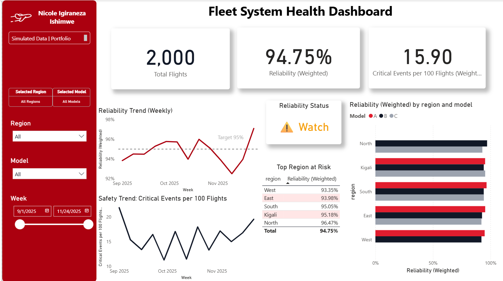
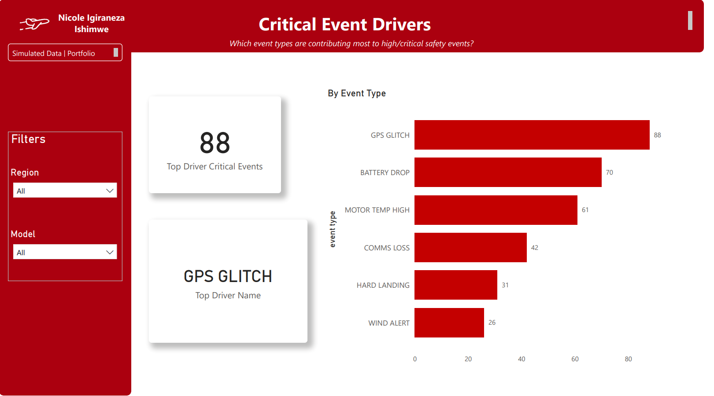

# Fleet Monitoring Analytics (SQL + Snowflake + Power BI + Python)

This project simulates a systems engineering analytics stack for **system health monitoring**:
- Generate / ingest raw event logs (flights, events, maintenance)
- Compute **reliability + safety metrics** using SQL (joins, aggregations, window functions)
- Model data in a **warehouse** (Snowflake: RAW → CLEAN → ANALYTICS marts)
- Build a **Power BI monitoring dashboard** with drilldowns + alert thresholds
- Run **Python** anomaly detection and generate an incident report

## Quickstart (2 minutes)
1) Clone the repo
2) Install Python dependencies
3) Generate data and outputs
4) Open the Power BI dashboard

Commands:
pip install -r requirements.txt
python python/src/run_all.py

Then open:
powerbi/Fleet_System_Health_Dashboard.pbix

Optional: If you want the Snowflake version, open:
powerbi/Fleet_System_Health_Dashboard_Snowflake.pbix

📌 Metrics reference: [docs/metrics_definition.md](docs/metrics_definition.md)

## What you’ll find here
- `sql/` — SQL schema + metric queries (reliability, safety, incident rates)
- `snowflake/` — warehouse scripts and curated marts
- `powerbi/` — dashboard file and exports
- `python/` — notebooks + scripts (data generation, anomaly detection)
- `data/` — generated and cleaned CSVs (small sample only)

## Architecture (high level)
Raw logs (CSV) are generated and stored in `data/raw/`, then transformed into analytics outputs used by dashboards.

Data flow:
Synthetic logs → SQL metrics (DuckDB) → outputs CSV → Power BI dashboards
Optional: outputs CSV → Snowflake RAW/CLEAN/ANALYTICS → Power BI Snowflake dashboard

## Dashboard preview

### What this dashboard answers
- Fleet reliability (success rate) trend over time
- Safety signal via critical events per 100 flights
- Which regions are most at risk
- How reliability differs by region and vehicle model

### Key definitions (simple)
- Reliability (Weighted) = successful flights ÷ total flights
- Critical events per 100 flights = (critical events ÷ total flights) × 100
- Status thresholds: Good ≥ 95%, Watch 93–95%, Risk < 93%
- Target line: 95% reliability

## Data dictionary (core fields)
- WEEK: week start date
- REGION: operational region
- MODEL: platform variant label (A, B, C are generic simulated variants)
- FLIGHTS_TOTAL: total flights in the week
- FLIGHTS_SUCCESS: successful flights in the week
- RELIABILITY_PCT: (FLIGHTS_SUCCESS / FLIGHTS_TOTAL) × 100
- CRITICAL_EVENTS_PER 100 FLIGHTS: (CRITICAL_EVENTS / FLIGHTS_TOTAL) × 100
- EVENT_TYPE: type of event logged (GPS_GLITCH, BATTERY_DROP, etc.)

## Assumptions and limitations
- Data is synthetic and simplified to simulate fleet operations
- Reliability is defined as success rate (successful flights divided by total flights)
- Critical events are counted equally (no severity weighting beyond critical vs non critical)
- Operational drivers like weather, payload, route difficulty, and software releases are not modeled
- The CLEAN layer in Snowflake is intentionally light to keep the project reproducible and fast to run

### Vehicle model definitions (A, B, C)
The `model` field represents simulated platform variants:
- We have model A, model B, and model C. 

### Current findings (based on your current view)
- Overall reliability ≈ 94.75% → Watch (below 95% target)
- West and East are lowest reliability (top regions at risk)
- Safety trend fluctuates and rises near the end of the window → needs investigation

### Actions you’d take (systems thinking)
- Investigate weeks where reliability dips: correlate with event spikes
- Break down critical events by event type (comms loss, battery drop, etc.)
- Identify whether issues are model-specific or region-specific

## Drivers dashboard

Critical Event Drivers: The highest driver of high/critical safety events is GPS Glitch (88 events in the current view), followed by Battery Drop and Motor Temp High. This view helps prioritize root-cause investigation by event type and segment findings by region/model via filters.

## Results
- Overall reliability is monitored weekly against a 95% target
- West/East show lower reliability in the current view (risk prioritization)
- GPS Glitch is the top critical event driver (drivers page)

## Key skills demonstrated (ATS keywords)
SQL · window functions · joins · aggregations · query optimization  
Snowflake · data warehouse · data models · curated marts  
Power BI · dashboarding · monitoring · alert thresholds · stakeholder reporting  
Python · pandas · numpy · matplotlib · Jupyter · anomaly detection

## How this maps to a Systems Engineering Data Analyst role
- Monitoring dashboards: Power BI overview and drivers pages with filters for region, model, and time
- Alert thresholds: status logic (Good Watch Risk) and target reliability line at 95 percent
- SQL: joins, aggregations, window functions, week over week change, and event driver summaries
- Warehouse modeling: Snowflake RAW → CLEAN → ANALYTICS structure and analytics views
- Data quality: validation checks and data quality view patterns
- Stakeholder reporting: weekly incident report style summary based on the same tables

## Roadmap
1) Generate synthetic fleet logs (so the project is reproducible)  
2) Build SQL metrics + weekly reliability tables  
3) Create Snowflake warehouse layers + marts  
4) Build Power BI dashboard (exec + engineering views)  
5) Add Python anomaly detection feeding incidents back to analytics

## How to run the pipeline

Install dependencies, then run the one-command pipeline:

python python/src/run_all.py

This regenerates:
- data/raw/*.csv
- data/clean/*.csv
- data/outputs/weekly_metrics.csv (used by the Power BI dashboard)
